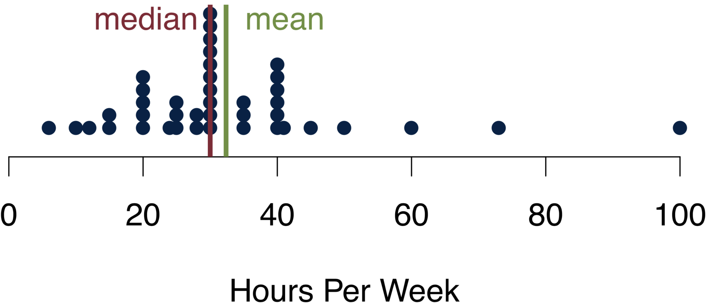

<!-- # Describing Data  -->
<!-- <!-- For next time: Introduce quantile function. Also min and max. also how to save data as an .xls--> -->

<!-- ```{r echo=FALSE, include=FALSE} -->
<!-- # -- housekeeping --------------------------------------------------------------  -->
<!-- rm(list=ls()) -->
<!-- # Libraries -->
<!-- library(foreign) -->
<!-- library(xtable) -->


<!-- # data: Class surveys -->
<!-- dat18 <- read.csv("preparing_data/data/class_survey/lecture_survey_18.csv") -->
<!-- dat19 <- read.csv("preparing_data/data/class_survey/lecture_survey_19.csv") -->
<!-- dat <- read.csv("preparing_data/data/class_survey/lecture_survey_21.csv") -->

<!-- # names(dat) -->
<!-- attach(dat) -->

<!-- # Predefined Cardiff colours -->
<!-- # primary -->
<!-- cardiffred <- rgb(211,55,74, maxColorValue = 255) -->
<!-- cardiffblack <- rgb(35,31,32, maxColorValue = 255) -->
<!-- cardiffgrey <- rgb(47,68,78, maxColorValue = 255) -->
<!-- cardiffgold <- rgb(189,158,94, maxColorValue = 255) -->
<!-- # secondary  -->
<!-- cardiffblue <- rgb(21,44,81, maxColorValue = 255) -->
<!-- cardiffpurple1 <- rgb(29,15,51, maxColorValue = 255) -->
<!-- cardiffpurple2 <- rgb(60,44,89, maxColorValue = 255) -->

<!-- ``` -->

<!-- <!-- ## Readings for This Week --> -->
<!-- <!-- TODO: Make a general size for the figures in the preamble --> -->

<!-- ## Statistics to Summarise Data -->


<!-- When we describe data, we typically have three questions: -->


<!-- * How are the values of a variable in a sample distributed? -->
<!-- * What do typical values look like? -->
<!-- * How clustered or dispersed are these values? -->

<!-- ### Tables -->

<!-- Data that comes in categories---be they nominal or ordinal---can be easily summarised. Simply list possible values for a variable, together with the number of observations for each value. -->

<!-- * Can be used to summarise distributions of one nominal, ordinal or interval variable. -->
<!-- * Intervals must be constructed for interval-level variables (e.g. age, income). -->
<!-- * Absolute frequencies record the actual number of observations for each value. -->
<!-- * Relative frequencies record the proportional distribution of observations. -->

<!-- This is an example from our data: -->

<!-- ```{r echo = FALSE} -->
<!-- library(knitr) -->
<!-- nomtable <- data.frame(cbind(table(breakfast), prop.table(table(breakfast)))) -->
<!-- names(nomtable) <- c("Frequency", "Percent") -->
<!-- nomtable$Percent <- round(nomtable$Percent, digits = 2) -->
<!-- kable(nomtable, format = "html", table.attr = "style='width:30%;'") -->
<!-- ``` -->

<!-- This is how the data looks like for the question on how much you like summer. -->
<!-- ```{r echo = FALSE} -->
<!-- ordtable <- cbind(table(summer), prop.table(table(summer))) -->
<!-- tsummer <- data.frame(ordtable[c(2,1),]) -->
<!-- rownames(tsummer) <- c("Highest", 4) -->
<!-- colnames(tsummer) <- c("Frequency", "Percent") -->
<!-- tsummer$Percent <- round(tsummer$Percent, digits = 2) -->
<!-- kable(tsummer, format = "html", table.attr = "style='width:30%;'") -->
<!-- ``` -->

<!-- ### Central Tendencies -->

<!-- One of the first questions that comes to our minds when we consider a variable is: What is a typical value for it? Intuitively it makes sense to chose a value that shows the central tendency of a variable. There are three different statistics that can help summarise the distribution of scores by reporting the most typical or representative value of it. -->

<!-- #### Mode {-} -->

<!-- The mode is the value that occurs most frequently. You can use it for all kind of categorical data. There can be more than one mode and under this circumstance you would speak of multimodal data. In case the answer categories can be ranked, the mode does not need to be near the centre of the distribution. Finally, the mode is resistant to outliers. -->

<!-- For political scientists, the mode is a really important measure: We use it whenever we want to determine the winner of an election. When I asked you for your vote (if you had had the choice), this is how you responded. -->


<!-- ```{r echo = FALSE} -->

<!-- # voteordtable <- cbind(table(bidentrump), prop.table(table(bidentrump))) -->
<!-- # voteordtable -->
<!-- # xtable(voteordtable[-1,]) -->
<!-- dattemp <- data.frame(vote=c(15,1)) -->
<!-- names(dattemp) <- 'Votes' -->
<!-- rownames(dattemp) <- c('Biden' , 'NA') -->
<!-- kable(dattemp, format = "html", table.attr = "style='width:30%;'") -->
<!-- ``` -->
<!-- The modal candidate is clearly Biden for your class. Nobody would have voted for Trump. One response is missing. -->


<!-- #### Median {-} -->

<!-- The median is the value that falls in the middle of an ordered sample. Obviously, the measure cannot be used for nominal variables---they can not be ranked. The median is the 50th percentile point. This means that when you count all cases, half of the sample will be smaller than the median and the other half is larger than the median. When the sample size is even, the median is the midpoint between the two measurements in the centre.  -->

<!-- By definition, the median is resistant to outliers: Irrespective of how small the smallest value or how large the largest one, the one value that splits the sample in half will remain always the same. -->


<!-- ```{r echo=FALSE} -->
<!-- par(mar = c(4,1,1,1)) -->
<!-- stripchart(na.omit(studyideal) -->
<!-- 			, method = "stack" -->
<!-- 			, pch = 16 -->
<!-- 			, xlab = "Hours Per Week"			 -->
<!-- 			, col = cardiffred -->
<!-- 			, cex = 3 -->
<!-- 			, ylim = c(.6, 2) -->
<!-- 			, xlim = c(0,40) -->
<!-- 			, frame.plot = FALSE) -->

<!-- abline(v=median(studyideal, na.rm = TRUE), col = cardiffblue, lwd = 3) -->
<!-- text(y = 1.5, x=median(studyideal, na.rm = TRUE), pos = 4, col = cardiffblue,  -->
<!--      labels = paste("median =", median(studyideal, na.rm = TRUE)), cex = 1.5) -->
<!-- ``` -->

<!-- These are your responses to the question how many hours you think you should study. I chose the dark blue line to indicate the median value of the data. Overall, we have 16 responses in the data. Since the number of respondents is odd, the median is the average between the 8th and the 9th response. -->

<!-- #### Mean  {-} -->

<!-- The mean is the sum of the observations divided by the number of observations -->
<!-- 	\begin{equation*} -->
<!-- 		\bar{x} = \frac{x_1 + x_2 + \ldots + x_N}{N} = \frac{\sum_{i=1}^{N}x_i}{N} -->
<!-- 	\end{equation*} -->

<!-- with -->

<!-- * $\bar{x}$ being the mean of variable $x$; -->
<!-- * $\sum$ being the sum; -->
<!-- * $i$ the individual cases (of x); -->
<!-- * $N$ the number of cases. -->
<!-- \end{itemize} -->


<!-- This all looks a bit fancy, but it is actually just a matter of understanding the notation. Conceptually, the mean is really straightforward---it is nothing different than the good old average. -->

<!-- The mean has a couple of interesting characteristics. It is only applicable to interval variables. The mean is a good measure of central tendency for roughly symmetric distributions, but it can be misleading in skewed distributions. Most importantly, the mean is really susceptible to outliers. There is a nice physical interpretation of the mean: it is the [centre of gravity](https://www.youtube.com/watch?v=f2I8GJy1EMo) of the observations. -->


<!-- ```{r, echo=FALSE} -->

<!-- par(mar = c(4,1,1,1)) -->
<!-- stripchart(na.omit(studyideal) -->
<!-- 			, method = "stack" -->
<!-- 			, pch = 16 -->
<!-- 			, xlab = "Hours Per Week"			 -->
<!-- 			, col = cardiffred -->
<!-- 			, cex = 3 -->
<!-- 			, ylim = c(.6, 2) -->
<!-- 			, xlim = c(0,40) -->
<!-- 			, frame.plot = FALSE) -->
<!-- abline(v=mean(studyideal, na.rm = TRUE), col = cardiffgold, lwd = 3) -->
<!-- text(y = 1.5, x=mean(studyideal, na.rm = TRUE), pos = 2, col = cardiffgold,  -->
<!--      labels = paste("mean =", mean(studyideal, na.rm = TRUE)), cex = 1.5) -->
<!-- abline(v=median(studyideal, na.rm = TRUE), col = cardiffblue, lwd = 3) -->
<!-- text(y = 1.5, x=median(studyideal, na.rm = TRUE), pos = 4, col = cardiffblue,  -->
<!--      labels = paste("median =", median(studyideal, na.rm = TRUE)), cex = 1.5) -->

<!-- ``` -->

<!-- Take a look at your data. Your mean is slightly lower than your median. Why is that so? Basically, those who study less than 10h per week have a considerable influence on the mean and push the mean to the left of the median. -->

<!-- <!--     -->

<!-- ```{r,echo=FALSE,out.width="45%",out.height="20%",fig.cap='test',fig.show='hold',fig.align='center'} -->
<!-- knitr::include_graphics(rep(c("figures/medianmean13.png","figures/medianmean14.png")), 1) -->
<!-- ```  -->
<!-- --> -->

<!-- <!-- TODO maybe compare to the other years? --> -->


<!-- ### Spread  -->
<!-- You now know how to chose a typical value that summarises your data. Next on the list is to characterise their spread. Are all values really close to one another? Are they far apart? Do many of them hang out on one side of the distribution, and are they far apart on the other side, i.e. is their distribution skewed? -->

<!-- To measure all this, we will now take a look at different measures of spread. In essence, they are statistics that summarise the variation around our average value. We will consider [four](https://en.wikipedia.org/wiki/Fantastic_Four) different measures that all build on each other. -->

<!-- * *Range:* Difference between two values, typically the minimum and the maximum. -->
<!-- * *Deviation:* Difference of a value from the mean. -->
<!-- * *Variance:* Squared difference of a value from the mean. -->
<!-- * *Standard Deviation:* Square root of the squared difference of a value from the mean. -->


<!-- #### Range {-} -->
<!-- The range is the the distance between the largest and the smallest values, i.e. maximum--minimum. It will be distorted by extreme values. -->

<!-- The interquartile range is another really important range. It covers the middle 50% of observations, so the range from the 25th percentile to the 75th percentile (lower quartile--upper quartile). -->

<!-- ```{r echo=FALSE} -->
<!-- iqrruler <- seq(200, 212, 1) -->
<!-- fixer <- rep(1, length(iqrruler)) -->

<!-- par(mar = c(4,1,1,1)) -->
<!-- plot(iqrruler, fixer -->
<!--      , ylab = "", xlab = "Range" -->
<!--      , axes = FALSE -->
<!--      , pch = 16 -->
<!--      , cex = 2 -->
<!--      , col = cardiffgrey -->
<!--      , ylim = c(0,2.5)  -->
<!-- ) -->
<!-- points(c(203, 206, 209), c(1,1,1) -->
<!--        , pch = 16 -->
<!--        , cex = 2.05 -->
<!--        , col = cardiffred) -->

<!-- text(203, 2, cex = 1, label = "25% Quantile", col = cardiffred) -->
<!-- text(206, 2, cex = 1, label = "50% Quantile \n Median \n Mean", col = cardiffred) -->
<!-- text(209, 2, cex = 1, label = "75% Quantile", col = cardiffred)		 -->
<!-- lines(c(203, 209), c(1,1) , col = cardiffred, lwd = 4) -->
<!-- ``` -->

<!-- Here you can a number of concepts that we covered working together to describe the data: The 25% quantile, the 50% quantile, the 75% quantile, the median, the mean and the interquartile range. -->


<!-- ```{r echo=FALSE} -->
<!-- par(mar = c(4,1,1,1)) -->
<!-- stripchart(age -->
<!--            , method = "stack" -->
<!--            , pch = 16 -->
<!--            , xlab = "Age"			 -->
<!--            , col = cardiffgrey -->
<!-- 			     , cex = 3 -->
<!-- 			     , ylim = c(.6, 2) -->
<!--            , xlim = c(15,30) -->
<!--            , frame.plot = FALSE) -->
<!-- interest <- summary(age)[c(2,3,5)]			 -->
<!-- abline(v=interest, col = c(cardiffred, cardiffgold, cardiffred), lwd = 3) -->
<!-- abline(v=interest[2], col = c(cardiffgold), lwd = 3, lty = 2) -->
<!-- text(x=interest[1],  y=1.5,label = "25% \n Quantile", cex = 1.2, col = cardiffred, pos = 2) -->
<!-- text(x=interest[2],  y=1.7,label = "50% Quantile", cex = 1.2, col = cardiffgold, pos = 4) -->
<!-- text(x=interest[3],  y=1.5,label = "75% Quantile", cex = 1.2, col = cardiffred, pos = 4) -->
<!-- ``` -->
<!-- Let us describe some of your data, here how old you are. How large would be the interquartile range? Hint: the value is `r interest[3]-interest[1]`. -->


<!-- #### Deviation {-} -->

<!-- The deviation of any observation is its difference from the mean. -->
<!-- 	\begin{equation*} -->
<!-- 		(x-\bar{x}) -->
<!-- 	\end{equation*} -->


<!-- What is the sum of deviations? Do the maths with a couple of numbers on a piece of paper.  -->
<!-- 	\begin{equation*} -->
<!-- 		\sum(x-\bar{x}) = ? -->
<!-- 	\end{equation*} -->

<!-- <!-- IN THE FUTURE ADD A SMALL VIDEO FOR THAT HERE --> -->
<!-- You will find that it is always 0---simply because the values keep cancelling each other out. So what can we do? One solution would be to calculate the Mean Absolute Deviation $\text{MAD}$. -->
<!-- 	\begin{equation*} -->
<!-- 		\text{MAD}=\frac{\sum(|x_i-\bar{x}|)}{n} -->
<!-- 	\end{equation*} -->

<!-- In case you do not know the sign "$|$": anything that is in between two "$|$" will always return its positive value. So $|5| = 5$ and also $|-5| = 5$. -->

<!-- Let us take a look at your data, here how much you actually study and how much you think you should study. -->

<!-- ```{r, echo=FALSE} -->
<!-- par(mar = c(4,5,1,1)) -->
<!-- stripchart(list(studyideal, studyperweek) -->
<!--            , pch = 16 -->
<!--            , xlab = "h Per Week"			 -->
<!--            , col = cardiffgrey -->
<!--            , cex = 3 -->
<!--            , ylim = c(.6, 3) -->
<!--            , xlim = c(0,40) -->
<!--            , frame.plot = FALSE -->
<!--            , axes = FALSE -->
<!--            , jitter = 0 -->
<!-- ) -->


<!-- points(quantile(studyperweek, c(.25, .75), na.rm=TRUE), c(2,2), col = cardiffred, pch = 16, cex = 3) -->
<!-- points(quantile(studyideal, c(.25, .75), na.rm=TRUE), c(1,1), col = cardiffred, pch = 16, cex = 3) -->
<!-- axis(2, col = "white", las = 1, at = c(1,2),lab =c("h Ideally", "h Studied")) -->
<!-- lines(quantile(studyperweek, c(.25, .75), na.rm=TRUE), c(2,2), col = cardiffred, lwd = 2) -->
<!-- lines(quantile(studyideal, c(.25, .75), na.rm=TRUE), c(1,1), col = cardiffred, lwd = 2) -->

<!-- points(c(mean(studyideal, na.rm = TRUE),mean(studyperweek)), c(1,2), col = cardiffgold, pch = 16, cex = 3) -->
<!-- axis(1) -->

<!-- # Some calculations for calling later -->
<!-- MAD_actual <- sum(abs(studyperweek - mean(studyperweek, na.rm = TRUE)), na.rm = TRUE)/length(studyperweek) -->
<!-- MAD_ideal <- sum(abs(studyideal - mean(studyideal, na.rm = TRUE)), na.rm = TRUE)/length(studyideal) -->


<!-- MAD_actual_var <- sum((studyperweek - mean(studyperweek, na.rm = TRUE))^2, na.rm = TRUE)/length(studyperweek)-1 -->
<!-- studyperweek.var <- var(studyperweek, na.rm = TRUE) -->
<!-- studyideal.var <- var(studyideal, na.rm = TRUE) -->

<!-- studyperweek.sd <- sd(studyperweek, na.rm = TRUE) -->
<!-- studyideal.sd <- sd(studyideal, na.rm = TRUE) -->


<!-- ``` -->
<!-- I am including again the interquartile range in red (which goes from where to where again?), and the mean in gold. When you do the maths you will find out that the $\text{MAD}_{\text{actual}} = `r round(MAD_actual, 2)`$ and $\text{MAD}_{\text{ideal}} = `r round(MAD_ideal, 2)`$  -->


<!-- #### Variance  {-} -->
<!-- In practice, however, you will find that the Mean Absolute Deviation, is rarely used. Instead, you can often find the variance. It is basically the same as the $\text{MAD}$, but different. To avoid the canceling out, we will square the distance of each value to the mean. And for arcane statistical reasons that irrelevant for this class, we now subtract 1 from the overall cases $n$ in the denominator. -->
<!-- \begin{equation*} -->
<!-- 			s^2=\frac{\sum(x_i-\bar{x})^2}{n-1} -->
<!-- \end{equation*} -->

<!-- With the study data, the variance of the actual number of hours you study is $s^2_{\text{actual}} = `r round(studyperweek.var, 2)`$ and the variance for the number of hours you consider ideal is $s^2_{\text{ideal}} = `r round(studyideal.var, 2)`$. Contrast the difference between the two variances to the difference in the two $\text{MAD}$---it is much larger! The reason is simply that we are now taking the sum of the *square* of the distances and not just that *absolute* distances, which of course weighs much more for larger numbers. With the $\text{MAD}$ each data point contributes an equal share to the overall measure of spread. For the variance, this is no longer true. Those data that are further apart from the mean will drive the variance to a much larger degree than those data that are close to the mean. -->


<!-- #### Standard Deviation {-} -->
<!-- While the variance is already a big step forward in measuring spread, it has one important drawback: It is quite abstract and really hard to interpret. Ideally, we would want to understand the measure for spread on the same metric as the data themselves. -->

<!-- Doing so is straightforward. We simply take the square root of the variance---and the resulting standard deviation is in the metric of our data $x$. -->

<!-- \begin{equation*} -->
<!-- 			s=\sqrt{\frac{\sum(x_i-\bar{x})^2}{n-1}} -->
<!-- \end{equation*} -->

<!-- In our running example---the number of h you study and the number of h you think you should study---this is what we get. The standard deviation for the former is $s_{\text{actual}} = `r round(studyperweek.sd, 2)`$ and the standard deviation for the latter is $s_{\text{ideal}} = `r round(studyideal.sd, 2)`$.  -->

<!-- Compare these values to the Mean Absolute Distances: $\text{MAD}_{\text{actual}} = `r round(MAD_actual, 2)`$ and $\text{MAD}_{\text{ideal}} = `r round(MAD_ideal, 2)`$. They, too, are on the original scale. The standard deviation, however, is much more sensitive to outliers, which is a really desirable characteristic. -->


<!-- ### Ratios and Rates -->
<!-- Finally, ratios and rates. -->

<!-- #### Proportions {-} -->
<!-- We start with something really simply, the proportion. It is calculated as  -->

<!-- \begin{equation*} -->
<!-- 	p = \frac{f}{N} -->
<!-- \end{equation*} -->

<!-- With -->
<!-- * $p$ being the proportion; -->
<!-- * $f$ being the number of cases (frequency) in one category; -->
<!-- * $N$ being the number of cases in all categories of the variable. -->

<!-- The proportion is useful if we want to answer a question like: *What is the proportion of students having tea for breakfast?* -->

<!-- ```{r echo=FALSE} -->
<!-- N <- length(breakfast) -->
<!-- f <- table(breakfast)[3] -->
<!-- ``` -->
<!-- \begin{equation*} -->
<!-- 	p = \frac{`r f`}{`r N`} = `r round(f/N, 2)` -->
<!-- \end{equation*} -->


<!-- #### Percentages {-} -->
<!-- You like percentages better? Simply multiply your proportions with $100$. -->

<!-- \begin{equation*} -->
<!-- 	P = \left( \frac{f}{N}\right) 100 = \left( \frac{`r f`}{`r N`} \right) 100 = `r round(f/N*100, 2)`\% -->
<!-- \end{equation*} -->


<!-- #### Rates  {-} -->
<!-- A rate is really useful if you want to express for example how often a proportion occurs in a given amount of time. We can calculate the rate as  -->
<!-- \begin{equation*} -->
<!-- 	r = \frac{\frac{f}{t}}{\frac{N}{u}} -->
<!-- \end{equation*} -->

<!-- with -->
<!-- * $r$ being the rate: the frequency per time in a certain set -->
<!-- * $f$ being the number of cases (frequency) in one category -->
<!-- * $t$ being the time under consideration -->
<!-- * $N$ being the number of cases in all categories of the variable -->
<!-- * $u$ being the unit under consideration -->

<!-- Let us advance step by step and wrap our head around this with the help of an example. We want to understand how many of you actually bought a computer during 2019. This simplifies our formula a bit. -->
<!-- ```{r echo=FALSE} -->
<!-- f <- table(computer19)[2] -->
<!-- t <- 1 -->
<!-- N <- length(computer19) -->
<!-- u <- 1 -->
<!-- ``` -->
<!-- \begin{equation*} -->
<!-- 	r = \frac{\frac{f}{t}}{\frac{N}{u}} = \frac{\frac{\text{computer purchases}}{\text{one year}}}{\text{all students}} = \frac{\frac{`r f`}{`r t`}}{\frac{`r N`}{`r u`}} = `r (f/t)/(N/u)` -->
<!-- \end{equation*} -->

<!-- We can take this a little further and ask *How many computers did 10 student buy in 2019?*. To answer this question, we simply adapt the number of people in the unit and set $u=10$. -->
<!-- ```{r echo=FALSE} -->
<!-- u <- 10 -->
<!-- ``` -->
<!-- \begin{equation*} -->
<!-- 	r = \frac{\frac{f}{t}}{\frac{N}{u}} = \frac{\frac{\text{computer purchases}}{\text{one year}}}{\frac{\text{all students}}{\text{unit of 10 students}}} = \frac{\frac{`r f`}{`r t`}}{\frac{`r N`}{`r u`}} = `r (f/t)/(N/u)` -->
<!-- \end{equation*} -->

<!-- So 10 students bought 3.75 computers in 2019. -->

<!-- #### Growth {-} -->
<!-- The last thing we want to look at is how much growth. In particular in economics, growth has a really prominent role, and a lot of theory is built around all kinds of growth related to different cash flow: GDP, GDP per capita, return on investments to just name a few. But of course, growth can also happen in other areas like literacy rates in development countries, unemployment or votes. Growth can be expressed as a percentage change. -->

<!-- \begin{equation*} -->
<!-- 	G = \left(\frac{f_2 - f_1}{f_1}\right) 100 -->
<!-- \end{equation*} -->

<!-- with  -->
<!-- * $G$ being the growth rate in a variable from time 1 to time 2 -->
<!-- * $f_1$ being the number of cases (frequency) at time $t_1$ -->
<!-- * $f_2$ being the number of cases (frequency) at time $t_2$ -->

<!-- Again, let us take a look at our own data to understand what is going on here. -->

<!-- ```{r echo=FALSE} -->
<!-- f_1 <- table(computer19)[2] -->
<!-- f_2 <- table(computer20)[2] -->
<!-- ``` -->
<!-- \begin{align*} -->
<!-- 	G &= \left(\frac{f_2 - f_1}{f_1}\right) 100 \\ -->
<!-- 	 &= \left(\frac{\text{Purchases in 2020} - \text{Purchases in 2019}}{\text{Purchases in 2019}}\right) 100 \\ -->
<!-- 	 &= \left(\frac{`r f_2 - f_1`}{`r f_1`}\right) 100 = `r round(100*(f_2 - f_1)/f_1, 2)`\% -->
<!-- \end{align*} -->

<!-- Apparently, you were purchasing less computers during the pandemic year, more specifically, the sales had a negative growth of $G = `r round(100*(f_2 - f_1)/f_1, 2)`\%$. This could be related to the fact that a number of you bought a new computer when you started your university career back in 2019. -->


<!-- ## Data Management with R -->
<!-- To calculate all above, we first need to take a closer look at some data management this week. -->

<!-- <!-- IN THE FUTURE ADD SELECTION WITH $ FROM DATA FRAMES HERE --> -->

<!-- ### Libraries -->
<!-- Libraries are functions that do not ship on board your original R programme. Instead, you have to get them from them internet. -->

<!-- Think of it like wanting to read a book. You first have to get it from a shop and bring it home, where you will add it to your book shelf. In R, you can use the command `install.packages()` to download a package to your computer. If you execute the command, R might prompt you for a location---simply pick one that is close to you. Obviously, `"name_of_library"` is a placeholder here, so [don't try this at home](https://open.spotify.com/album/2DHFJRBMsly28nJ8HrfdIJ?si=YUjhdyskRnuC6Y1QR22q_w) with that particular code snippet and replace it with the package you actually need. -->

<!-- ```{r eval=FALSE} -->
<!-- install.packages("name_of_library") -->
<!-- ``` -->

<!-- Now you have downloaded the programme to your computer. Or, in other words, you have added the book into your bookshelf. However, you are not sitting in your lounge chair with the book in your hand, yet. For that, you would still have to go to the library in your house and get the book. This is exactly what we will be doing now with the R package. We will collect the package from our library and load it into the active workingspace. -->


<!-- ```{r eval=FALSE} -->
<!-- library("name_of_library") -->
<!-- ``` -->

<!-- ### Setting the Working Directory -->

<!-- R is quite stupid. It does not know where to look for files---be they R code or any other data---unless you really tell it where to look for a file. -->

<!-- Typically, we will instruct R to make its home in the exact place where you save your main R script with a function called `setwd()`. As its argument, you -->
<!-- provide the path you are working in. For me on my office machine, this is how it looks like. -->

<!-- ```{r eval=FALSE} -->
<!-- setwd('/Users/foo/PL9239 Intro_data_science/intro_data_science_homepage') -->
<!-- ``` -->
<!-- Now, R will start looking for everything starting in that particular working directory. To see which working directory you are in, you can type -->

<!-- ```{r eval=FALSE} -->
<!-- getwd() -->
<!-- ``` -->


<!-- ### Reading Data -->

<!-- Working directories are particularly relevant if you want to read in data sets. Data mostly comes in two formats: comma separated values, or short .csv, and as a Microsoft Excel spreadsheet .xls. Most open data formats can be read in with a function that begins with `read.foo`. Of course, *just* reading it is not enough---you have to assign it to an object if you want to work with it. -->
<!-- ```{r eval=FALSE} -->
<!-- csvdata <- read.csv("dataset1.csv") -->
<!-- ``` -->

<!-- If we want to read in .xls data, we have to load a library that can help us with that. We will go with the `readxl` package. Again, we are assigning the data to an object so that we can call it later. -->

<!-- ```{r eval=FALSE} -->
<!-- library(readxl) -->
<!-- xlsdata <- read_excel("dataset1.xls", sheet='sheet_foo') -->
<!-- ``` -->


<!-- ### Saving Data -->
<!-- You can also save data. Let us create a toy data set again. -->

<!-- ```{r} -->
<!-- name <- c('Mark', 'Luise', 'Peter') -->
<!-- bike <- c('Mountainbike', 'Single_Speed', 'Racing_Bike') -->
<!-- hours <- c(4,7,8) -->

<!-- dat <- data.frame(name, bike, hours) -->
<!-- ``` -->

<!-- Now save it. -->
<!-- ```{r} -->
<!-- save(dat, file = "toydata.RData") -->
<!-- ``` -->

<!-- To check the magic of this we remove the data set and then try to call the object. -->
<!-- ```{r error=TRUE} -->
<!-- rm(dat) -->
<!-- dat -->
<!-- ``` -->
<!-- Nothing there. -->
<!-- ```{r} -->
<!-- load("toydata.RData") -->
<!-- dat -->
<!-- ``` -->
<!-- [Tada!](https://media.giphy.com/media/3o7TKQdzIQNAGPr9WU/giphy.gif) Worth noting at this stage, that when you use the native R way of saving data, R saves your actual object, here the object `dat`. -->


<!-- ## Describing Data Using R -->

<!-- Now, with a bit more of a background, we can calculate all of this week's statistics. In R, this is *really* straightforward. Let us cover the commands for central tendencies and spread for now, since they are built into R. -->

<!-- ### Central Tendencies -->
<!-- You can take a look at the frequency of categorical data with the function `table()`. This is your data on how many data you are partying per week---of course, out of pandemic times... -->

<!-- ```{r} -->
<!-- table(partydays) -->
<!-- ``` -->
<!-- Quite a number of party animals here. Now, what is the mode? We have to call a package for that function. -->

<!-- ```{r} -->
<!-- library(DescTools) -->
<!-- Mode(partydays) -->
<!-- ``` -->

<!-- The output is a bit cryptic at first, but it tells us that the value $3$ is the most frequent one and that $5$ individuals chose it. -->


<!-- For the median and the mean, let us take a look at a continuous variable. For example, how much money you spend when you go out. You call the median with `median()` and the mean with `mean()`. -->

<!-- ```{r} -->
<!-- median(spend) -->
<!-- mean(spend) -->
<!-- ``` -->
<!-- Stop for a second and think about the results: -->
<!-- * What does the relationship between the median and the mean tell us here?  -->
<!-- * Is the distribution really symmetric? -->
<!-- * Is the distribution maybe skewed? If so, how? -->


<!-- ### Spread  -->
<!-- The rest is a piece of cake just the like. You can calculate the variance using `var()` and the standard deviation with `sd()`. -->


<!-- ```{r} -->
<!-- var(spend) -->
<!-- sd(spend) -->
<!-- ``` -->


<!-- Please read chapter 7 in [@Fogarty2019]. Chapters 4 and 5 are a good idea, but you do not necessarily have to. -->


