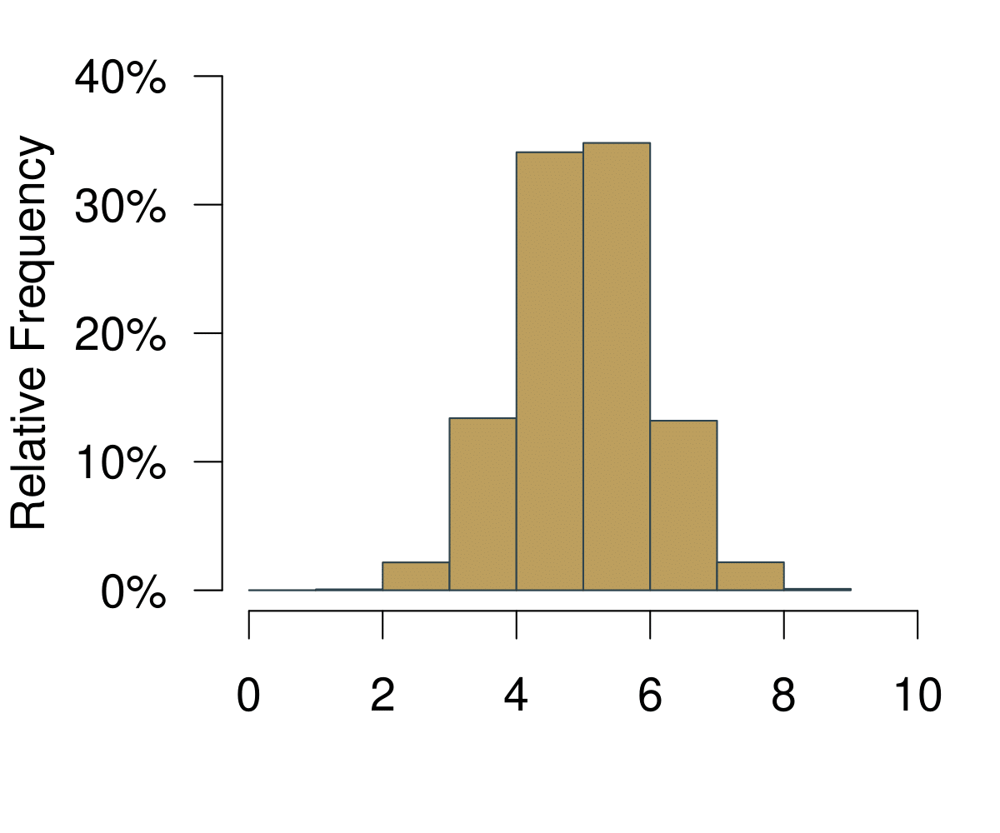
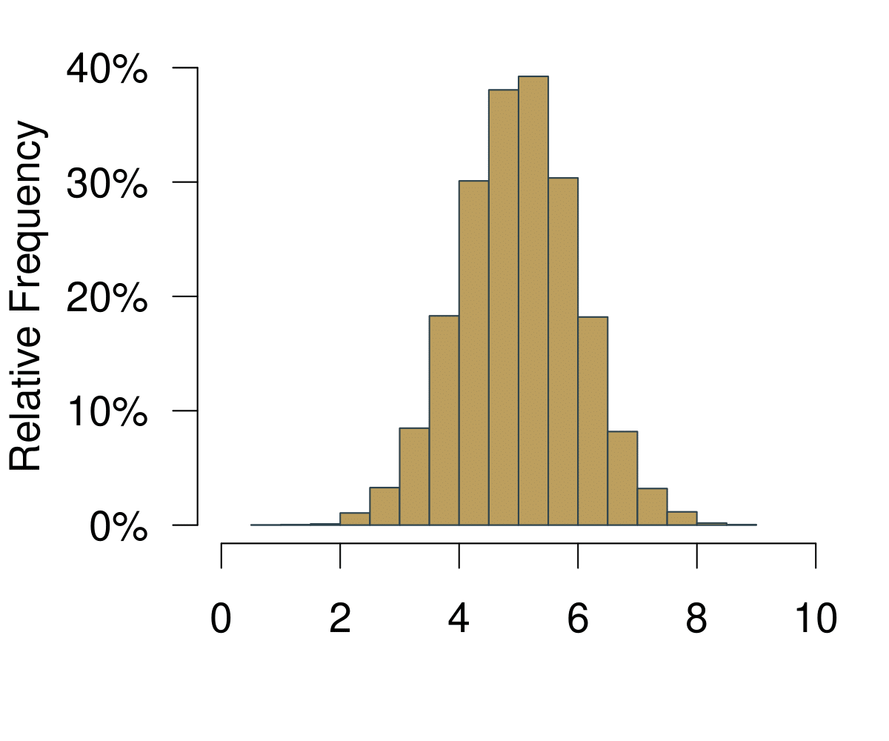
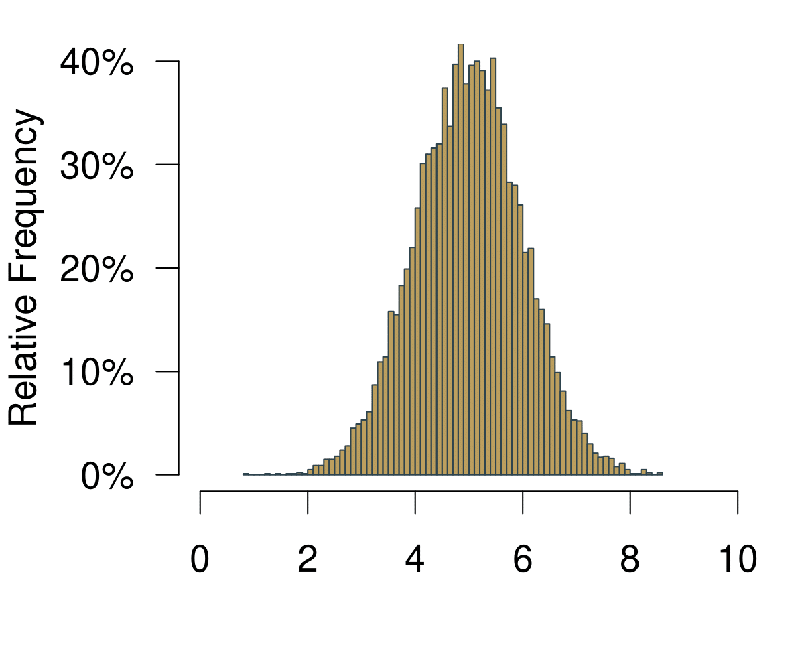
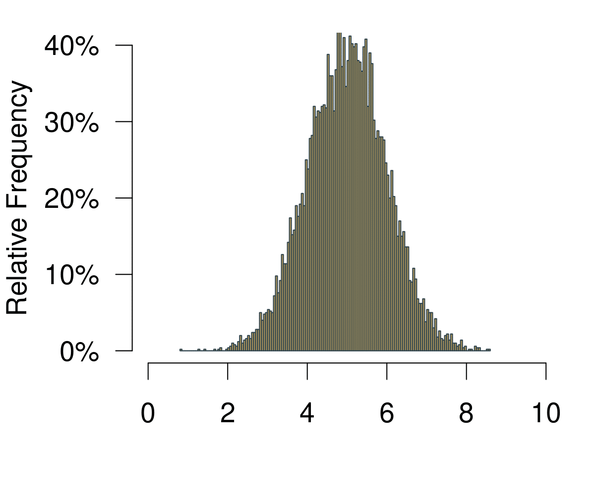
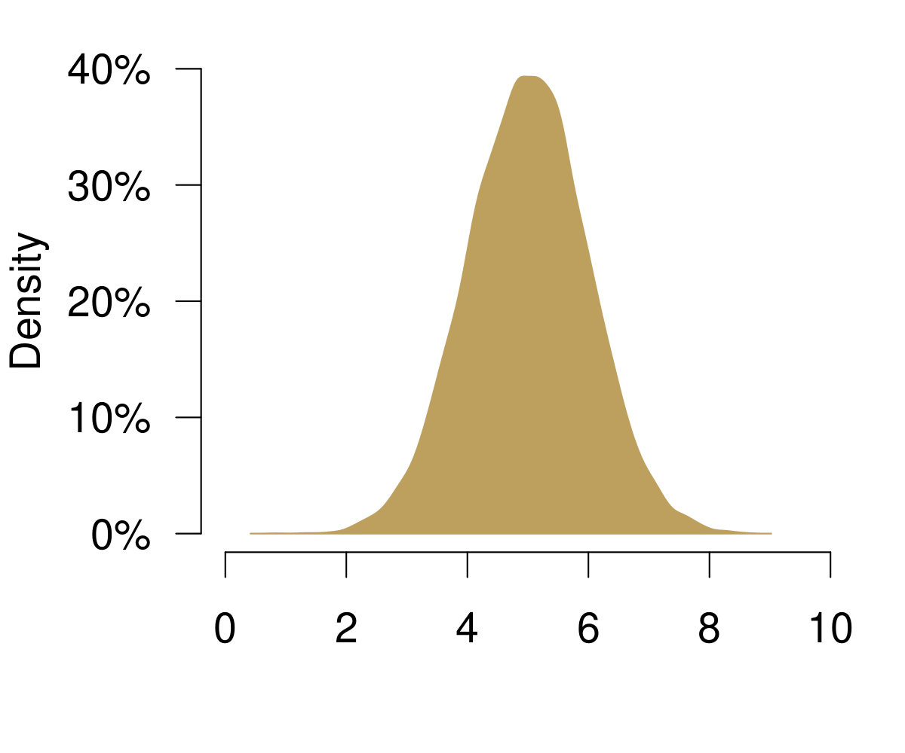
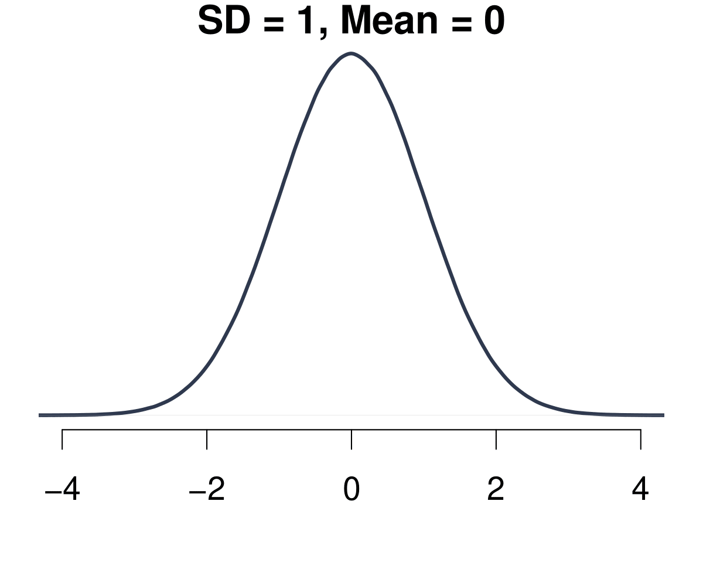
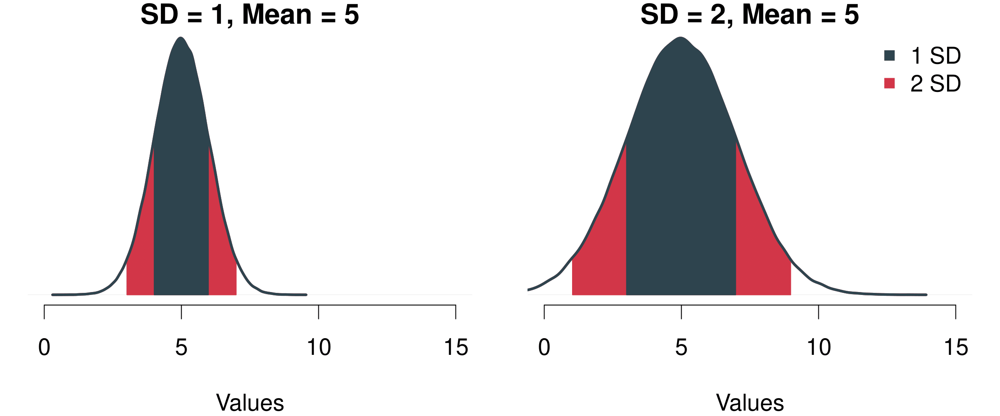
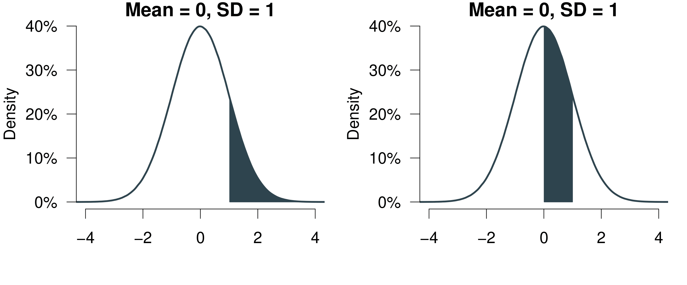
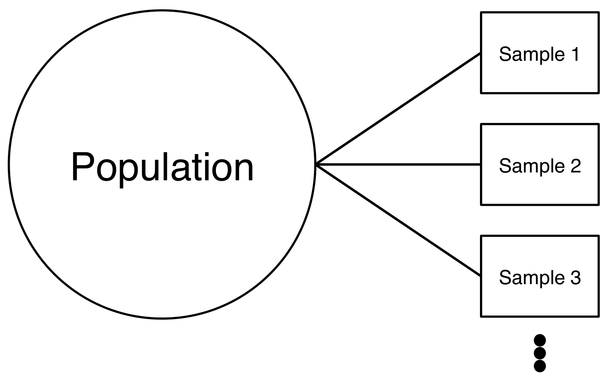
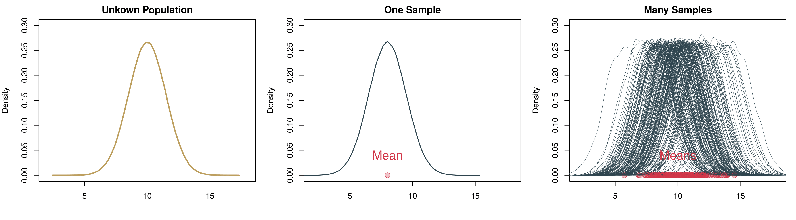

```{r echo=FALSE, include=FALSE}
# -- housekeeping -------------------------------------------------------------- 
rm(list=ls())
# Libraries
library(foreign)
library(xtable)


# data: Class surveys
dat18 <- read.csv("preparing_data/data/class_survey/lecture_survey_18.csv")
dat19 <- read.csv("preparing_data/data/class_survey/lecture_survey_19.csv")
dat <- read.csv("preparing_data/data/class_survey/lecture_survey_21.csv")

# names(dat)
attach(dat)

# Predefined Cardiff colours
# primary
cardiffred <- rgb(211,55,74, maxColorValue = 255)
cardiffblack <- rgb(35,31,32, maxColorValue = 255)
cardiffgrey <- rgb(47,68,78, maxColorValue = 255)
cardiffgold <- rgb(189,158,94, maxColorValue = 255)
# secondary 
cardiffblue <- rgb(21,44,81, maxColorValue = 255)
cardiffpurple1 <- rgb(29,15,51, maxColorValue = 255)
cardiffpurple2 <- rgb(60,44,89, maxColorValue = 255)

```


# Why Does Hypothesis Testing Work? A Primer on Probability


Why do we care so much about inference? We can calculate central tendencies and spreads. Why learn more?

This week we are revisiting the concepts from last week and will take a closer look at them. To goal is that you gain a deeper understanding about what it is that we are actually doing here.

* What does inference mean?
* Why does all this inference actually work?
* And why is it so important to properly randomise the samples that we draw?
* How can we be 95% confident about the test of a hypothesis?


## Distributions
What does inference actually mean? To properly understand the idea behind it, let us begin with distributions and a number of related ideas that will all be useful. 


### Probability 

We start with with probability and take a look at a definition. Let us define probability from a frequentist perspective.

> The probability of an outcome is the frequency of that outcome if the process were repeated a large number of times. 

This says that we can learn the probability of an event by *trying it out* many times---whatever *it* means.

Here are some examples that you know from everyday life.

* Toss a coin: The probability to get a 'head' is Pr(head) = 1/2 --- if the coin is fair of course.
* Toss a [dice](https://www.youtube.com/watch?v=4Dryu8gybd0): 
  * The probability to throw a 1 is Pr(1) = 1/6
  * The probability to throw everything else than a 1 is Pr(not 1) = 5/6

While you cannot observe these probabilities from one throw alone, try it out a couple of times, say, 100? Or even better 1000? You should get really close to the *true* underlying value of the probability. 

### Distribution 
The next useful concept is the distribution. You can get to the distribution of an event in a pretty straightforward way. Imagine we were playing [Boule](https://en.wikipedia.org/wiki/Boules) in our local club 'Allez les Bleus'. On our Thursday evening training sessions we are trying to hit a line that is exactly 5m away. As avid data aficionados we are measuring each try and record the data in a spread sheet. At home you sit down and chart of histogram of all the tries that we have been throwing.

HAUI

```{r fig.show="hold", out.width="30%", fig.align="center", fig.cap="A Histogram Becoming a Distribution.", echo=FALSE}
# This works in the browser but not in the R Markdown Viewer.

knitr::include_graphics("./figures/w5_distr2.png")




```


On the horizontal axis you are observing the possible outcomes. In statistical theory, this area is also called the *sampling space*. In the example with the coin, the sampling space $S$ of one fair flip one coin is $S = {H, T}$ where $H = \text{heads}$ and $T = \text{tails}$ are the outcomes. Here it is how far we can throw.

On the vertical axis you are at first simply observing the frequencies. Increasing the number of bins of the histogram leads to increasingly realistic representations of the data. With infinite number of bins, you end up with a continuous representation of the data. Once the data is continuous, we do not speak of frequencies any longer---simply because each point on the x-axis is not infinitely small. We now call the vertical axis density.

Given our definition of probability above, if we were to repeatedly throw the *boule* infinitely many times, the resulting data would be the distribution of the probability to actually hit the 5m line. 

There is an important property of distributions: Everything under the curve adds up to 1. This means that probability distributions have a straightforward geometric interpretation: we can simply ask for value ranges that we are interested in and see how often we would observe it.


```{r, eval=knitr::is_html_output(excludes = "epub"), results = 'asis', echo = F}
cat(
'<iframe width="560" height="315" src="https://www.youtube.com/embed/TJ8cd9UrJl8" frameborder="0" allow="accelerometer; autoplay; clipboard-write; encrypted-media; gyroscope; picture-in-picture" allowfullscreen></iframe>'
)
```

### The Normal Distribution 
But if we want to know more, we have to introduce a more rigorous concept of what a probability distribution actually is. Let us get to know the Normal Distribution, a very special probability distribution. This is how it looks like.


```{r fig.show="hold", out.width="30%", fig.align="center", fig.cap="A Histogram Becoming a Distribution.", echo=FALSE}
# This works in the browser but not in the R Markdown Viewer.

```


The Normal Distribution has a number of important properties. 

* It is always a bell-shaped curve.
* It is always symmetrical.
* The mean = median = mode.
* The tails are asymptotic, which means the values get closer to the x-axis the further you go into infinity, but never intercept it.
* Two parameters drive the distribution: The mean $\mu$ and the standard deviation $\sigma$.


The Normal Distribution has a proper formula that allows us to calculate its density. Remember, the mean $\mu$ and the standard deviation $\sigma$ determine how the function looks like. Then, given any value $x$ we can calculate the resulting density. The formula for the probability density function was discovered by [Carl Friedrich Gauss](https://en.wikipedia.org/wiki/Carl_Friedrich_Gauss).

\[f(x; \mu,\sigma^{2})=\frac{1}{\sqrt{2\pi\sigma^{2}}}
			exp \left[ - \frac{(x-\mu)^{2}}{2\sigma^{2}} \right] \]

The parameter $\pi$ is the [famous mathematical constant](https://en.wikipedia.org/wiki/Pi). The expression $exp(\cdot)$ is short for $e^{(\cdot)}$, where $e$ is yet another important mathematical constant, the [Euler number](https://en.wikipedia.org/wiki/E_(mathematical_constant)). You do not have to understand all details here, the main point is that you can see how $\mu$ and $\sigma$ drive the shape of the whole thing. 

The resulting shape of the function has yet another couple of great characteristics. The area covered within the bounds of the standard deviation always remains the same:

*  The area ± 1 SD from the mean always covers 68.3%
*  The area ± 2 SD from the mean always covers 95.4%
*  The area ± 3 SD from the mean always covers 99.7% etc.

Take a look at the figure below. We have two different Normal distributions. On the left, $\mu$ = 5 and $\sigma$ = 1 and on the right $\mu$ = 5 and $\sigma$ = 2. In both cases, the area that covers one standard deviation to the left and to the right of the mean covers 68.3%. This means that if we have a process that we can describe with this function, then we know that there is a probability of 68.3% that we end up with a value between 4 and 6 on the left figure. Likewise, with the same probability of 68.3% we will end up between 3 and 7 on the right figure. The same holds for all other values of the standard deviation (2 SD, 3 SD, ...) [Fascinating!](https://www.youtube.com/watch?v=cFods1KSWsQ).


```{r fig.show="hold", fig.align="center", fig.cap="Two Different Normal Distributions and The Probability Mass Covered By Their Standard Deviations.", echo=FALSE}
# This works in the browser but not in the R Markdown Viewer.

```


This is really useful, because *independent of the exact shape of the Normal Distribution*---that is *indenendent of the values of $\mu$ and $\sigma$*---we can now draw all kinds of probabilities using simple geometry. 

```{r fig.show="hold", out.width="100%", fig.align="center", fig.cap="A Histogram Becoming a Distribution.", echo=FALSE}
# This works in the browser but not in the R Markdown Viewer.

```

Remember what we know: one standard deviation to both sides covers 68.3%, two standard deviations to both sides covers 95.4%.

* The probability to observe a value between 0 and 1: 34.15%. We know that 1 standard deviation to the left *and* right adds to 68.3%, so 68.3%/2 = 34.15%.
* The probability to observe a value > 1: 15.85%. Simply take the left 50% and also add the one standard deviation to the right of the mean 68.3%/2 = 34.15%. So 50% + 34.15% = 84.15%. Now given that all under the curve adds up to 100% we simply subtract the 84.15%---and get 15.85%.


### Your Standard Measure z-scores
What are z-scores and why do we need them? We can use them if we want to make comparisons across samples. For example, we might want to compare the effort from two students Alexandra and Bastian who are in different cohorts. *In comparison to their peers*, is Alexandra more diligent than Peter?

* Alexandra studies 40h per week, Bastian 42h. So *prima facie*, Bastian is working more. But: Is he working more than Alexandra *in the light of the different study regimes of their cohorts?*
* To determine who studies harder we can standardize the effort of each of the students: How different are Alexandra and Bastian from the typical student in their class?


The idea is straightforward: We calculate the difference of each student from the average per spread of their respective cohorts. To compare variables from different distributions, we can standardize them by building so called ‘z-scores’.

 \[ z_{i} = \frac{x_{i}-\bar x}{\sigma} \]

A so standardized variable will have mean zero and a standard deviation of one. Let us do the math.

* We learn that Alexandra’s class has a mean of 30h with a standard deviation of 5. 
* Bastian’s class has mean of 40h with standard deviation 6.
* We begin with the z-score from Alexandra. It is $z_A =(40−30)/5=2$ 
* Bastian's z-score is $z_B =(42−40)/6=0.33$

What do we conclude? Well, Alexandra is on average much more 'off' in comparison to her peers than Bastian. She is much more of an outlier and he actually is much more of an average guy when it comes to studying.

[One more thing.](https://www.youtube.com/watch?v=sdqMvEZTxlI) The z-scores have a link to the Normal distribution. We can actually use them to calculate the probability of an event. 

The only thing you have to do is convert your data into z-score. And then you can look up its probability in the probability tables of a normal distribution. 


```{r fig.show="hold", out.width="50%", fig.align="center", fig.cap="A Histogram Becoming a Distribution.", echo=FALSE}
# This works in the browser but not in the R Markdown Viewer.
knitr::include_graphics(normalizePath("./figures/w5_norm2.png"))
knitr::include_graphics(normalizePath("./figures/w5_zscores.png"))
```

Here is a quick video where I show you how to use the table.

```{r, eval=knitr::is_html_output(excludes = "epub"), results = 'asis', echo = F}
cat(
'<iframe width="560" height="315" src="https://www.youtube.com/embed/HKY1XE9sA-8" frameborder="0" allow="accelerometer; autoplay; clipboard-write; encrypted-media; gyroscope; picture-in-picture" allowfullscreen></iframe>'
)
```


## Inference 
Let us continue with a proper look at inference. We will revisit some topics we talked about last week---but this time in a much more rigorous way. We might be interested in all sorts of research questions.

* Which party would citizens vote for?
* How many hours do school-children study at home? 
* How many children do parents wish to have?


The problem is pretty straightforward: We cannot ask everybody or count everything. What do we do? Well, we take a look at a sample. With the sample, we will try to answer to questions.

Given what we observe in the sample:

* What is the most probable value in the population out there? 
* How certain are we about our results?


### Some Key Concepts
Before we learn how to answer these questions, we will take a look at some key concepts.

*Population*

> The full set of cases about which we want to generalise.

*Sample*

> A subset of the population.

*Variable*

> Logical set of attributes (characteristics) of an object (person, thing, etc.) that can vary across a range.

*Parameter*

> A characteristic of a population; usually unknown.

*Descriptive Statistics*

> Statistics that summarise the distribution of the values of variables in a sample.

*Inferential Statistics*

> The use of statistics to make inferences about a larger population based on data collected from a sample.

### Population and Samples 

We said already that we can never know the whole population, simply because it is impossible to ask every single individual. Imagine we are interested in learning how the distribution of a particular variable looks like in the population---e.g. income, voting intention etc.. This means that we are particularly keen learn two key variables.

* The population mean $\mu$
* The population standard deviation $\sigma$


How could learn about the population? We can draw one sample and measure

* the sample mean $\bar m_i$;
* and the sample standard deviation $s_i$.


Note that the notation for population parameters is in Greek letters, while the sample parameters will always be Roman letters.

This will give us a first impression about how the distribution looks like. Can we take any sample? Think of the following situation. Imagine you wanted to predict the upcoming elections in Wales. You are asking 1000 people about their voting intention. To do so, you walk in the rainy streets of Cardiff until you collected 1000 responses---and 36% intend to vote for the green party. Can you trust in this result? Well, let us see: You have an idea about how 1000 people who had a reason to be on the streets of Cardiff are intending to vote. But it could be that those people might have a particular political preference. For example, they were out and about despite the weather conditions. It would be quite reasonable to assume that they are more environmentalists than those who stayed at home---or even those who live outside Cardiff. 

If you want to know about the voting intention in *all* Wales, you probably need a good representation of what is going on in *all* Wales. Ideally, you would be able to have a completely random draw from all Welsh voters---and not only those who were on the streets of Cardiff on a particularly rainy day.

Luckily, when we generate the sample with our computer, we can simulate a truly random sample How could we improve our knowledge about the population? We could draw many more samples, calculate the mean and standard deviation from them and learn how much all these means and standard deviations vary. This would refine our idea about the average typical value in the population and the average spread of the data in the population. 

```{r fig.show="hold", out.width="50%", fig.align="center", fig.cap="Drawing Many Samples from the Population.", echo=FALSE}
# This works in the browser but not in the R Markdown Viewer.

```


Doing so, we are retrieving another distribution: The distribution over the averages of our samples. This distribution is also called *sampling distribution*. As with any distribution, we are interested in two key values.

* First the mean of sampling distribution of means $\bar m_i$.
* Second the standard deviation of sampling distribution of means $s_n$


Let us take a look at a *real* example in Figure \@ref(fig:distribution-sampling). On the left, there is the unknown distribution in the population. We then randomly draw one sample from this distribution. You can see that for a random reason, it is a bit off. If this were in the real world, we of course would not know that we are off---we only have this one sample. Since we are simulating everything on the computer we take many more samples. You can see on the right that we are retrieving many samples with their bell-shaped distributions. For each of these individual samples we can calculate an average. And you can see all averages accumulate at the bottom of the right hand figure as red points: if you closely inspect these means, they are clustering in 'the middle'. This center actually *is* the true underlying population parameter.


```{r distribution-sampling, fig.show="hold", out.width="100%", fig.align="center", fig.cap="Drawing Many Samples from the Population.", echo=FALSE}
# This works in the browser but not in the R Markdown Viewer.

```

If we were able to repeat the sampling a great number of times, there actually *is* a way in which we can really measure the unkown population parameter $\mu$, the average of the *population*.

* We can estimate the population mean $\mu$ as the average over all means from all samples.
* The means of all samples also vary of course, which means we can calculate a standard deviation for them. This standard deviation of the means of the samples---so the standard deviation of the sampling distribution---is called the *standard error*. 

### The Central Limit Theorem

If you closely look at how the means of the samples are actually distributed, do you notice something? Well, it looks a bit as if they were distributed in a bell shaped way---just like the Normal distribution we heard of before.

So here is another amazing thing about ['the Normal'](https://www.youtube.com/watch?v=Pb0tvv1ojUE). The whole world would probably not really work if it did not exist. The reason is: all statistical processes boil down to being normal eventually---as proven by the mathematician [Pierre-Simon Laplace](https://en.wikipedia.org/wiki/Pierre-Simon_Laplace) some 200 years ago.


Informally, this is what the Central Limit Theorem is saying.

* Imagine we have a population distribution with mean $\mu$ and variance $\sigma^2$ and we are interested in its mean.
* Repeatedly taking samples from that distribution, yields the sampling distribution of the mean which approaches a normal distribution with mean $\mu$ and variance $\sigma^2/n$ as the observation in each sample $n$ increases.
* This holds regardless of the shape of the original distribution.
* The Central Limit Theorem is the basis for application of statistics to many *natural* phenomena (which are the sum of many unobserved random events).
* How? Take a sample, calculate its mean. Do the same thing again and again. The distribution of sample means will be normal.


This is a fun application of it: the Galton Board. Balls are entered at the top and have to take a series of left-right decisions. The result of it in the end is the normal distribution. Remember: independent of the original stochastic process, if all tries are truly random, the resulting distribution ends up being normal. By the way, here in Cardiff's [Techniquest](https://www.techniquest.org/) there is a massive version of the Galton Board where you can try this yourself.


```{r, eval=knitr::is_html_output(excludes = "epub"), results = 'asis', echo = F}
cat(
'<iframe width="560" height="315" src="https://www.youtube.com/embed/3m4bxse2JEQ" frameborder="0" allow="accelerometer; autoplay; clipboard-write; encrypted-media; gyroscope; picture-in-picture" allowfullscreen></iframe>'
)
```


In the video, this works well for the large and the medium balls. But it does not really work for the small ones. Why not? David Bulger offers a great intuition in the comments:

> Watching the small balls fall, you can see that they tend to gather momentum and run in diagonal paths to the left or right—that is, they don't change direction much. This illustrates the importance of the independence assumption in the central limit theorem: if the individual random variables are not independent, then their sum may not tend to a normal distribution.


So you see how key it is that the sampling happens truly at random. Everything breaks down if we cannot guarantee the randomness of the sampling process.


The Central Limit Theorem is the foundation for any inference that we want to do. And it will be really helpful for answering a question you might have on your mind already. With the computer you can draw many samples and calculate their averages to get to the population parameter. But in practice this is not possible: We typically have money to field *one* survey---and not many different ones. How do all these insights about the sampling distribution help us in practice? 

Enter the Central Limit Theorem (CLT). We know that *if sampling occurs randomly* the whole sampling distribution results in a normal distribution. It is OK therefore to be bold enough and assume that 
the sample we draw is normally distributed. We can therefore calculate an estimate for the key parameters we are interested in from our sample. 

Given our sample, what would be our best guess for the unknown population parameter $\mu$? Well, the average of our sample, right? Our estimate for $\mu$ is therefore

\[ \hat{\mu} = \bar m_i \]

Note that the hat indicates an estimate.

What can we say about our uncertainty of our mean of the sample, the standard error? We know it will follow a normal distribution (CLT!). If we knew the true population standard deviation $\sigma$, we could easily calculate it from one single sample. 

\[  s_n = \frac{\sigma}{\sqrt{n}} \]

Of course we do not know the true population parameter. So what do we do? We again use the value from the sample and assume that we have the right value. The estimate for the standard error then is as follows.

\[  \hat{s}_n = \frac{s_i}{\sqrt{n}} \]

Let us take a look at an example to make this more easy to understand. We assume your sample is a random sample from your cohort. How many hours does your cohort sleep per night? And what is our uncertainty around that?

```{r echo=FALSE}
m_i <- round(mean(dat$How.many.hours.do.you.usually.sleep.per.night.), 2)
s_i <- round(sd(dat$How.many.hours.do.you.usually.sleep.per.night.), 2)

n <- length(dat$How.many.hours.do.you.usually.sleep.per.night.)


```


\[\hat \mu = \bar m_i = `r m_i` \]

\[ \hat \sigma_i = \frac{\hat \sigma}{\sqrt{n}} = \frac{`r s_i`}{\sqrt{`r n`}} = `r round(s_i/sqrt(n), 2)`  \]


### Summing Up: What is Inference?

Let us take stock and understand the core idea of inference.
* We can never know the true population mean $\mu$.
* We will take the next best guesses: Measures on the basis of our
sample.
* We will make use of the mean, the standard deviation and the size of the sample.
* We rely on the fact that random samples would typically give us a good idea about the population (Central Limit Theorem).
* And then we assume that the sample mean is the population mean.
* We then use the standard deviation from our sample to estimate the standard error of the sampling distribution.


### Confidence Intervals: Being 95% Certain

Last thing to wrap your heads around for today: We have the standard error. How certain can we be that our sampled mean is close to the population mean?

The thing is, in real life we can of course  never know the true population mean $\hat \mu$. But we can use the Central Limit Theorem! We know that our sample---if well implemented---is a result of a random sampling process. And if that is the case, all samples including ours will follow the Central Limit Theorem (CLT). 

Let us assume we want to catch the population mean with our sample in 95 out of 100 samples. That means from the mean, we have to cover the area 42.5% to the left of the mean and 42.5% to the right of the mean. We call this area the *95% confidence interval*. 

```{r fig.show="hold", fig.align="center", fig.cap="Two Different Normal Distributions and The Probability Mass Covered By Their Standard Deviations.", echo=FALSE}
# This works in the browser but not in the R Markdown Viewer.

```


Remember that we were talking about the z-scores above? Using z-scores, we now can translate this statement about probabilities into units of standard deviation in a real distribution. If we want to cover the central 95% of a distribution, we have to go 1.96 times the standard deviation to the left of the mean and 1.96 times the standard deviation to the right of the mean. 

Knowing that we can assume that the sampling distribution is normally distributed (hat tip CLT), we can calculate the probability that we cover the range of values where we will capture the real mean in 95 out of 100 times. It is the range given by

\[  \hat\mu ± 1.96 \hat \sigma \]

Or in our example *How many hours do you sleep at night?*

\[  `r m_i` ± 1.96 `r s_i` = [`r m_i - 1.96 * s_i`, `r m_i + 1.96 * s_i`] \]

This means that if we drew 100 samples, the true population mean of your overall cohort would be in the interval [`r m_i - 1.96 * s_i`, `r m_i + 1.96 * s_i`] in 95 out of 100 times.


<!-- Insert a video here on the calculations by hand? -->

### Revisiting t-tests
The great thing about confidence intervals is that we can also use them to understand hypothesis testing.

Imagine we are testing whether there is actually a difference in the mean of two samples, just like we did last week with the t-tests. Instead of checking the p-value, we can also study the confidence interval. In 95 out of 100 cases, how much of a difference do we expect to be there between the two samples, given what we observe in the data?

```{r echo=FALSE}
ttest.perweek.21.18 <- t.test(dat18$studyperweek, studyperweek)
ttest.perweek.21.18
```

R returns us the confidence interval: Here, it is anywhere between `r round(ttest.perweek.21.18$conf.int, 2)[1] ` and `r `round(ttest.perweek.21.18$conf.int, 2)[2]`. This means that your confidence interval covers the 0---with a probability of 95% you could not tell whether the true difference in the means is lower 0, equal 0 or higher than 0. Hence, you cannot refute the original hypothesis that the means are the same. Therefore, you have to conclude that the means are probably the same.


Remember that the difference between you and the cohort in 2019 was *statistically significant*?

```{r echo=FALSE}
ttest.perweek.21.19 <- t.test(dat19$studyperweek, studyperweek)
ttest.perweek.21.19
```

Now, the confidence interval it is anywhere between `r round(ttest.perweek.21.19$conf.int, 2)[1] ` and `r `round(ttest.perweek.21.19$conf.int, 2)[2]`. The confidence interval *does not* cover the 0. You can conclude that with a probability of 95% the difference between the cohort *is* larger than 0. Now, you can refute the original hypothesis that the means are the same---at least with a 95% confidence in the results. 


## Revisiting the Original Questions
Let us revisit the original questions we initially set out above. 

* What does inference mean?
* Why does all this inference actually work?
* And why is it so important to properly randomise the samples that we draw?
* How can we be 95% confident about the test of a hypothesis?

If you worked through this class properly and also did the readings, you should be able to answer the questions. If not, let's be in touch in the weekly workshop on Tuesdays.

## A Simple Figure With Two Variables
This week was quite heavy on concepts, hence let us be really quick on the coding. Just a simply plot of two variables. In all we are doing, I am introducing some functions for randomly sampling in different ways.
Let us first do a random draw from a normal distribution. We then calculate a second variable from it, adding a bit of normally distributed noise on top. Then we plot it using colour.

```{r}
# Select var1 randomly from a normal distribution
var1 <- rnorm(n = 100, mean = 5, sd = 3)
# Select some noise again randomly from a normal distribution
var2.noise <- rnorm(n=100, mean = 0, sd = 0.5)
# create second variable
var2 <- var1 + var2.noise

# Here I sample two colours randomly 
allcolours <- colours()
two.colours <- sample(allcolours, 2)

# Plot two variables
plot(var1, var2, 
     pch = 21, # Setting Point Characters, here filled circles
     col = two.colours[1], # using the first colour for the frame
     bg = two.colours[2], # using the second colour for the background
     las = 1, #rotates numbers on the left
     xlab = 'Label on the x-Axis')

# abline is very useful for plotting all sorts of lines
# a: intercept, b: slope
abline(a= 0, b = 1, col = cardiffred) 
# horizontal line at 0, lwd: line width
abline(h = 0, col = cardiffblue, lwd = 3)
# vertical line at 0, lty: line type
abline(v = 0, lty = 3)
```

## Reading for This Week
For this week, please read chapter 4 in @Agresti2018.


