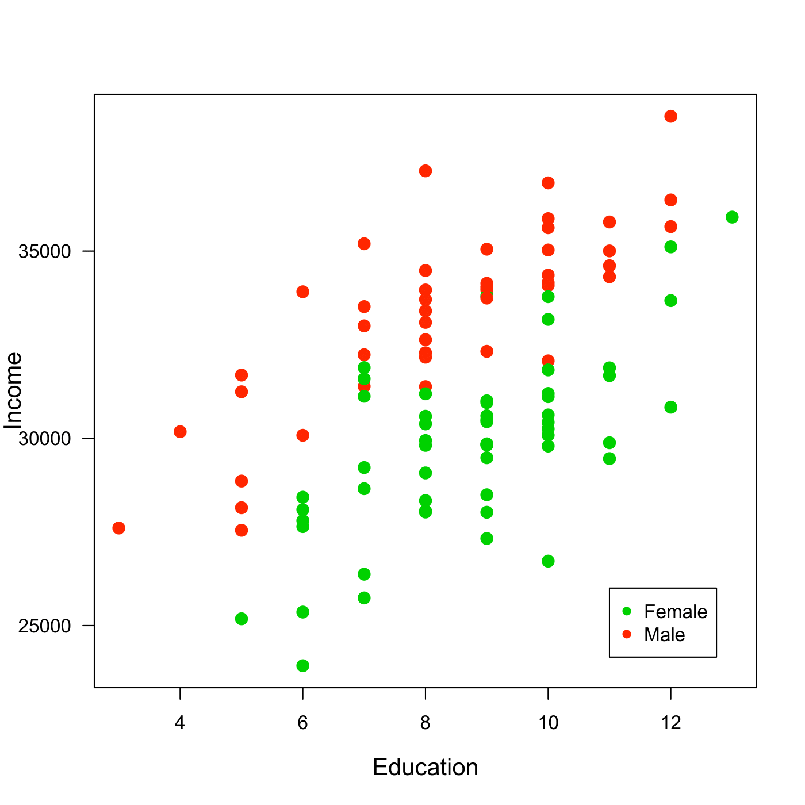
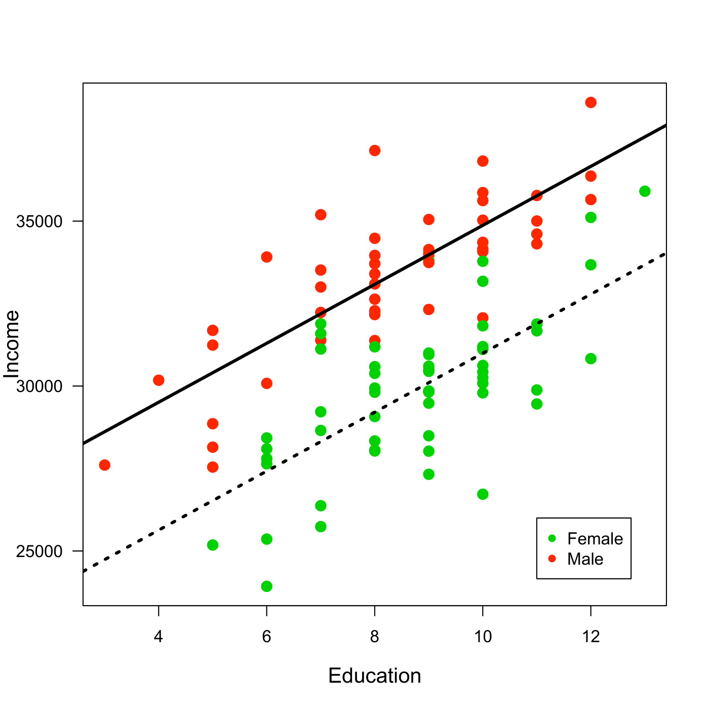
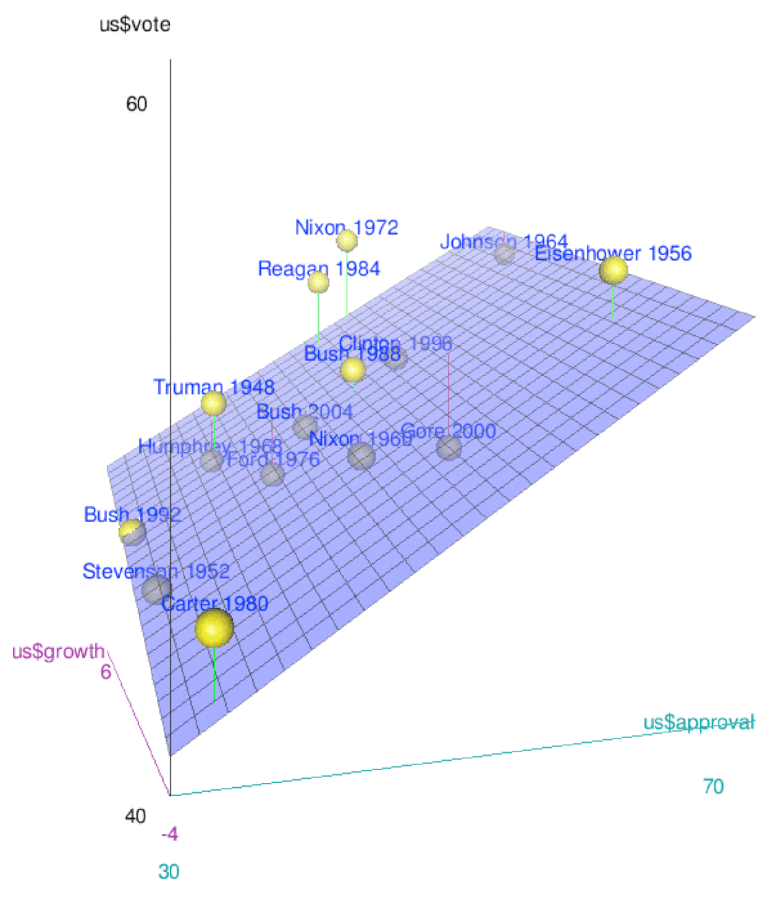

<!-- # Comparing Apples and Oranges -->

<!-- ```{r echo=FALSE, include=FALSE} -->
<!-- # -- housekeeping --------------------------------------------------------------  -->
<!-- rm(list=ls()) -->
<!-- # Libraries -->
<!-- library(foreign) -->
<!-- library(xtable) -->
<!-- library(knitr) -->
<!-- library(DescTools) -->

<!-- # data: Class surveys -->
<!-- dat18 <- read.csv("preparing_data/data/class_survey/lecture_survey_18.csv") -->
<!-- dat19 <- read.csv("preparing_data/data/class_survey/lecture_survey_19.csv") -->
<!-- dat <- read.csv("preparing_data/data/class_survey/lecture_survey_21.csv") -->

<!-- # names(dat) -->
<!-- attach(dat) -->

<!-- # Predefined Cardiff colours -->
<!-- # primary -->
<!-- cardiffred <- rgb(211,55,74, maxColorValue = 255) -->
<!-- cardiffblack <- rgb(35,31,32, maxColorValue = 255) -->
<!-- cardiffgrey <- rgb(47,68,78, maxColorValue = 255) -->
<!-- cardiffgold <- rgb(189,158,94, maxColorValue = 255) -->
<!-- # secondary  -->
<!-- cardiffblue <- rgb(21,44,81, maxColorValue = 255) -->
<!-- cardiffpurple1 <- rgb(29,15,51, maxColorValue = 255) -->
<!-- cardiffpurple2 <- rgb(60,44,89, maxColorValue = 255) -->

<!-- ``` -->

<!-- All the tools that we have so far are nice and good. But there are more things that we would like to do with data. So far, we learned how to make statements about bivariate relationships. But very often, we want to go beyond this. In our data, we might be interested to know the relationship between how many hours you study and how often you go out per week. But it might be, that there are also other factors that drive how many hours you actually study. We could be interested to know whether drinking coffee makes any difference for example---and that irrespective of how often you go out per week. After a late night out, you might be more inclined to have coffee in the morning, so just measuring the coffee is not enough. We will have to *control* for your partyness. -->

<!-- So we want to have a framework that allows us to do the following.  -->

<!-- * Measure the strength of association between more than 3 variables in the sample, controlling for all factors. -->
<!-- * Measure the strength of association between more than 3 variables in the population, controlling for all factors. -->
<!-- * Measure the uncertainty we have about these association in the population. -->


<!-- ## Bivariate Regression -->
<!-- The framework for all that is called *regression analysis*. Let us build it up one step at a time. -->

<!-- What is Regression Analysis? In the literature you can find many descriptions. -->

<!-- * "Regression analysis involves making quantitative estimates of theoretical relationships between variables." -->
<!-- * "A technique which involves fitting a line to a scatter of points." -->
<!-- * "Regression represents a most typical association between two variables and can be considered analogous to the mean in univariate descriptive statistics." -->
<!-- * "Regression tries to explain changes in one variable (dependent) as a function of changes in other variables (independent)." -->
<!-- * "Causality is implied." -->


<!-- At the end of the day, what regression does is to fit a line that is closest to all observations. Which one of the three would you pick? -->

<!-- ```{r echo=FALSE, out.width='80%', fig.align="center"} -->

<!-- par(mar = c(2,2,1,1)) -->
<!-- a1 <- runif(20, 2,20) -->
<!-- b1 <- 2*a1 + rnorm(20, 0, 4) -->
<!-- plot(1,1  -->
<!-- 		, xlim = c(0, 22), ylim = c(0, 40) -->
<!-- 		, xlab = "", ylab = "" -->
<!-- 		, type = "n", las = 1 -->
<!-- 		) -->
<!-- points(a1, b1, col = cardiffblue, cex = 1.3, pch = 16) -->
<!-- abline(1, 2, col = cardiffred, lwd = 3) -->
<!-- abline(5, 1.5, col = cardiffgrey, lwd = 3) -->
<!-- abline(-1, 2.2, col = cardiffgold, lwd = 3) -->

<!-- ``` -->

<!-- We want to chose the one that fits the data best so that we can express the relationship between the variables with a simple formula.  -->

<!-- \[ Y  = \alpha + \beta X      \] -->

<!-- with -->

<!-- * Y the dependent variable  -->
<!-- * X the explanatory variable -->
<!-- * $\alpha$ the intercept  -->
<!-- * $\beta$ the slope -->


<!-- Fitting the line is easy with well behaved data. These are three different intercepts $\alpha$ and we fit them to their respective data. -->


<!-- ```{r echo=FALSE,out.width='80%', fig.align="center"} -->

<!-- par(mar = c(2,2,1,1)) -->
<!-- a1 <- runif(20, 0,20) -->
<!-- b1 <- 2*a1 + rnorm(20, 0, 2) -->
<!-- a2 <- runif(20, 0,20) -->
<!-- b2 <- 2*a2 + 10 + rnorm(20, 0, 2) -->
<!-- a3 <- runif(20, 0,20) -->
<!-- b3 <- 2*a3 -15 + rnorm(20, 0, 2) -->
<!-- plot(1,1 , las =1 -->
<!-- 		, xlim = c(0, 22), ylim = c(0, 40) -->
<!-- 		, xlab = "", ylab = "" -->
<!-- 		, type = "n" -->
<!-- 		) -->
<!-- points(a1, b1, col = cardiffblue, cex = 1.3, pch = 16) -->
<!-- abline(0, 2, col = cardiffblue, lwd = 3) -->

<!-- points(a2, b2, col = cardiffgold, cex = 1.3, pch = 16) -->
<!-- abline(10, 2, col = cardiffgold, lwd = 3) -->

<!-- points(a3, b3, col = cardiffred, cex = 1.3, pch = 16) -->
<!-- abline(-15, 2, col = cardiffred, lwd = 3) -->


<!-- ``` -->

<!-- And here is how we could also fit different slopes $\beta$ through the data. -->


<!-- ```{r echo=FALSE, out.width='80%', fig.align="center"} -->
<!-- par(mar = c(2,2,1,1)) -->
<!-- a1 <- runif(20, 0,20) -->
<!-- b1 <- 2*a1 + rnorm(20, 0, 2) -->

<!-- a2 <- runif(20, 0,20) -->
<!-- b2 <- -1.5*a2  + 40 + rnorm(20, 0, 2) -->

<!-- a3 <- runif(20, 0,20) -->
<!-- b3 <- 20 + rnorm(20, 0, 2) -->

<!-- plot(1,1  -->
<!-- 		, xlim = c(0, 22), ylim = c(0, 40) -->
<!-- 		, xlab = "", ylab = "" -->
<!-- 		, type = "n", las = 1 -->
<!-- 		) -->
<!-- points(a1, b1, col = cardiffblue, cex = 1.3, pch = 16) -->
<!-- abline(0, 2, col = cardiffblue, lwd = 3) -->

<!-- points(a2, b2, col = cardiffgold, cex = 1.3, pch = 16) -->
<!-- abline(40, -1.5, col = cardiffgold, lwd = 3) -->

<!-- points(a3, b3, col = cardiffred, cex = 1.3, pch = 16) -->
<!-- abline(20, 0, col = cardiffred, lwd = 3) -->


<!-- ``` -->

<!-- ### How Does It Work? -->

<!-- The big question of course is, how does this fitting work? The first thing we have to understand is that there will be an error to our estimation.  -->

<!-- If an association between two variables were perfect, we would speak of a deterministic relation. Take for example the conversion of temperature. When we want to calculate the temperature in Fahrenheit from Celsius, we can follow the easy formula  -->

<!-- \[ \text{Fahrenheit} = 32 + (9/5 ∗ \text{Celsius})\]. -->

<!-- Here, $Y$ can be perfectly predicted from $X$ using an $\alpha = 32$ and a $\beta = 9/5$. -->

<!-- In practice things often follow probabilistic relations which are inexact, so we need to account for this mistake with an error and add $e$ to the formula. -->

<!-- \[  Y_i = a+ b X_i + e \]  -->

<!-- If we fit such a line, we can calculate residuals. They are the difference between the actual value of $y_i$ and the predicted value $\hat y_i$ from the regression model. In the figure, you can see the residuals as red lines. -->

<!-- \[y_i − \hat y = e_i\] -->

<!-- ```{r echo=FALSE, out.width='80%', fig.align="center"} -->


<!-- par(mar = c(2,2,1,1)) -->
<!-- x <- runif(20, 0,20) -->
<!-- y <- x + rnorm(20, 0, 3) -->
<!-- ab <- lsfit(x,y) -->
<!-- aEst <- ab$coeff[1] -->
<!-- bEst <- ab$coeff[2]		 -->
<!-- yEst <- aEst+bEst*x -->
<!-- plot(1,1  -->
<!-- 		, xlim = c(0, 23), ylim = c(0, 23) -->
<!-- 		, xlab = "", ylab = "" -->
<!-- 		, type = "n" -->
<!-- 		) -->
<!-- # Data -->
<!-- points(x, y, col = cardiffblue, cex = 1.5, pch = 16) -->
<!-- # estimates -->
<!-- abline(ab$coeff, col = cardiffgold, lwd = 3) -->
<!-- points(x, yEst, col = cardiffgold, cex = 1.5, pch = 16) -->
<!-- segments (x, y, x, yEst,col=cardiffred, lwd = 2) -->
<!-- legend(15, 5, col = c(cardiffblue, cardiffgold), pch = 16, legend = c('Data','Estimates'), box.col = 'white',cex = 1.5) -->


<!-- ``` -->


<!-- #### Fitting the Line -->

<!-- We can find [the perfect line](https://www.youtube.com/watch?v=xlXk49Mh7go) by fitting the line with a technique called Ordinary Least Squares (OLS). We choose the line that minimises the sum of the squares of the distances between each observation and the regression line. -->

<!-- \[ \sum (y_i-\hat{y_i})^2 = \sum {e_i}^2 \] -->

<!-- $\sum {e_i}^2$ is also called the Residual Sum of Squares (RSS). To fit the regression line, we minimise the RSS. This is it.  -->

<!-- Implementing this routine means we minimise the distance between our observation and the predictions on the line. In the figure above, we would minimise the (squared) length of the red lines connecting the predictions in yellow and the real data in blue. -->

<!-- Using this OLS estimator, we can calculate the slope $b$.  -->


<!-- \[ b = \frac{\text{covariation}}{\text{variance}} = \frac{\sum (x_i-\bar{x})\sum (y_i-\bar{y})}{\sum (x_i-\bar{x})^2} \] -->

<!-- Give we now know the slope $b$ the intercept $a$ is then really straightforward and  -->

<!-- \[ 		a = \bar{y} - b\bar{x} \]. -->

<!-- Let us calculate the parameters for a small data set with a regression by hand. -->

<!-- ```{r, eval=knitr::is_html_output(excludes = "epub"), results = 'asis', echo = F} -->
<!-- cat( -->
<!-- '<iframe width="560" height="315" src="https://www.youtube.com/embed/vOfc5VHGIWw" frameborder="0" allow="accelerometer; autoplay; clipboard-write; encrypted-media; gyroscope; picture-in-picture" allowfullscreen></iframe>' -->
<!-- ) -->
<!-- ``` -->

<!-- #### Inference -->

<!-- We fitted a line through our sample. We now know how to guess the best fitting line through our data. What can we say about the population that is behind our sample?  -->

<!-- We will proceed in a similar way as we did when we were estimating the mean for a population last week. Of course, we do not know the population parameter for the intercept $\alpha$ and the slope $\beta$ and we actually will never be able to know it unless we were to ask every single individual in the population. But given that we have a sample, we already have a good guess. The most likely values $\hat \alpha$ and $\hat \beta$ are the ones that we can calculate using our sample, so \[ \hat \alpha = a \] and \[ \hat \beta = b \].  -->


<!-- #### Uncertainty -->
<!-- We also want to be realistic about the uncertainty of our estimate. Remember that we were calculating a standard error for a sample mean? And that we used it to then calculate the confidence interval around our sample mean? Back then, we used the standard deviation from our sample as the *best guess*. We will do the same for the two parameters $\hat \alpha$ and $\hat \beta$ here.  -->


<!-- Let us begin with the standard error for our estimated slope $\beta$. -->
<!-- <!-- \[ --> -->
<!-- <!-- Var(\beta_1) = \frac{\sigma^2_\epsilon }{\sum{(x_i-\bar x)^2}}	 --> -->
<!-- <!-- \] --> -->
<!-- \[ -->
<!-- 	se(\beta_1) = \frac{\sigma_\epsilon}{\sqrt{\sum{(x_i-\bar x)}^2}} -->
<!-- \] -->

<!-- This is how to calculate the uncertainty for the intercept $\alpha$. -->

<!-- <!-- \[ --> -->
<!-- <!-- Var(\beta_0) = \frac{\sigma^2_\epsilon \sum{x_i^2}}{n \sum{(x_i-\bar x)^2}}  --> -->
<!-- <!-- \] --> -->
<!-- \[ -->
<!-- se(\beta_0) = \sqrt{\frac{\sum{x_i^2}}{n \sum{(x_i-\bar x)^2}}} \sigma_\epsilon 	 -->
<!-- \] -->


<!-- Of course, we do not know $\sigma^2_\epsilon$. But we will use the same trick like before and take the variance of the regression residuals.  -->

<!-- <!-- \[	\hat\sigma^2_\epsilon = \frac{\sum \epsilon_i^2}{n-p}		\] --> -->

<!-- <!-- Therefore,  --> -->

<!-- \[	\hat\sigma_\epsilon = \sqrt{\frac{\sum \epsilon_i^2}{n-p}} \]  -->

<!-- This yields the estimated standard error of the estimate---here $\hat\beta_1$. -->

<!-- \[	\hat{se}(\hat\beta_1) = \frac{\hat\sigma_\epsilon}{\sqrt{\sum{(x_i-\bar x)}^2}}	\] -->


<!-- With this estimated standard error, we can now calculate a *t-score*.  -->

<!-- \[  t = \frac{\hat \beta}{se(\hat \beta)}     \] -->

<!-- This t-score is conceptually quite similar to the z-scores we already know. It expresses a parameter that is standardised using its standard error. The beauty is that we know from statistical theory how it is distributed: It follows a t-distribution. This distribution is quite similar to the normal distribution, it is also bell shaped and symmetric.  -->

<!-- Given that we know its distribution, we can again calculate p-values. We interpret them in just the same way as we were interpreting them for the means in a sample---this time however with regards to the regression parameters. Assuming that the true, unknown population parameter $\beta$ is actually 0, how likely is it that we observe the estimated parameter $\hat \beta$ that we do? -->


<!-- #### Assumptions -->
<!-- Just to mention, since we will not go into details here: We can unrol all this framework because we are making a number of assumptions about the data.  -->

<!-- * The relationship between the dependent variable and the explanatory variables needs to be linear. -->
<!-- * The variance of the residual error must be constant -->
<!-- * The residual error must be normally distributed with a mean of 0. -->
<!-- * The expected value of the residual error must not depend on the data. -->


<!-- ### How Do We Interpret Results? -->

<!-- That was quite a bit. Let us take a look at some data to learn how to interpret results. -->

<!-- ```{r echo=FALSE} -->

<!-- summary(lm(dat$studyperweek ~ dat$studyideal)) -->

<!-- ``` -->

<!-- The core idea of interpreting these results is that we can take a look at two things.  -->

<!-- * What is the substantive effect? Remember that we have parameter estimates for our equation $Y  = \alpha + \beta X$.  -->
<!-- * In addition, there is also the uncertainty around the parameter estimates that we will have to account for.  -->


<!-- I am walking you through the interpretation via a video here. -->


<!-- ```{r, eval=knitr::is_html_output(excludes = "epub"), results = 'asis', echo = F} -->
<!-- cat( -->
<!-- '<iframe width="560" height="315" src="https://www.youtube.com/embed/SgbOGUqA8iI" frameborder="0" allow="accelerometer; autoplay; clipboard-write; encrypted-media; gyroscope; picture-in-picture" allowfullscreen></iframe>' -->
<!-- ) -->
<!-- ``` -->


<!-- ## Beyond Bivariate Regression -->

<!-- But the *real* reason we are here is to go beyond bivariate regressions. -->

<!-- ### Bivariate Regression Plus a Dummy -->

<!-- What is a dummy variable? Qualitative information often come in the form of binary information (zero-one variable). We call these kind of variables a dummy variable. -->
<!-- The benefit of capturing qualitative information using zero-one variables is that it leads to regression models with easy interpretations. Good coding practice: name your variable after the ‘1’ category; e.g. *Female* if the variable is coded 1 for female and 0 for male. *Gender* would be a confusing variable name. -->


<!-- #### How Does It Work? -->

<!-- Let us assume we examine the relationship between education and income among women and men and collect the following data. -->

<!-- ```{r fig.show="hold", out.width="80%", fig.align="center", fig.cap="Data for Income, Education and Gender. Note: Artifical Data.", echo=FALSE} -->
<!-- # This works in the browser but not in the R Markdown Viewer. -->
<!--  -->
<!-- ``` -->

<!-- We want to examine the relationship between education and income among women and men. Our model will be as follows -->

<!-- \[Income = \beta_{0}+\beta_{1}*Education+\beta_{2}*Female \] -->

<!-- #### How Do We Interpret Results? -->

<!-- We can interpret $beta_0$ and $beta_1$ as before. But now there is also $beta_2$. Its interpretation is fairly straightforward: it is nothing different than an intercept shift. -->

<!-- Suppose we fit the following regression model to our data: -->

<!-- \[ Income =  25934 +  894*Education -  3876*Female \] -->

<!-- We can see two regression lines, one for males and one for females. For the women we calculate -->
<!-- \[	Income =  25934 +  894*Education -  3876*1= 22058+894*Education \] -->

<!-- And for the men the equation looks like follows. -->

<!-- \[ Income =  25934 +  894*Education -  3876*0 = 25934 +894*Education \] -->

<!-- ```{r fig.show="hold", out.width="80%", fig.align="center", fig.cap="Regression through the data for Income, Education and Gender. Note: Artifical Data.", echo=FALSE} -->
<!-- # This works in the browser but not in the R Markdown Viewer. -->
<!--  -->
<!-- ``` -->


<!-- For example, we expect that a woman with 15 years of education earns earns on average. -->

<!-- \[ Income =  25934 +  894*15 -  3876*1 = 35468  \] -->


<!-- ### Multivariate Regression -->

<!-- We can of course go beyond just adding one dummy variable and one continuous variable to the regression equation---in fact you can add more than one from any variable to the regression equation. In the following example we will take a look at how that could look like.  -->

<!-- #### How Does It Work? -->

<!-- Let us examine the relationship between economic growth prior to an election, the approval for the president and the vote share received by the incumbent presidential party in the US. This is how the data looks like.  -->


<!-- ```{r fig.show="hold", out.width="60%", fig.align="center", fig.cap="Data on Presidential Elections in the US.", echo=FALSE} -->
<!-- # This works in the browser but not in the R Markdown Viewer. -->
<!--  -->
<!-- ``` -->

<!-- The vote share is on the vertical axis. We also have data for approval rating and for economic growth on the other two axes. Our model then becomes: -->

<!-- \[ \text{vote} = \beta_{0} + \beta_{1} \text{growth} + \beta_{2} \text{approval} + e \] -->


<!-- When we estimate regression model with two explanatory variables, we are effectively estimating the best fitting plane through the three dimensional data cloud. This works just as before: we will use the OLS estimator.  -->

<!-- #### How Do We Interpret Results? -->

<!-- These are the results of our regression equation. -->


<!-- ```{r echo=FALSE} -->
<!-- library(foreign) -->
<!-- dat.us <- read.dta('preparing_data/data/uspresidentialelections.dta') -->
<!-- load('preparing_data/data/uspresnew.Rdata') -->

<!-- summary(lm(us$vote ~ us$growth + us$approval)) -->
<!-- ``` -->

<!-- For the interpretation, let us visit a quick video again. -->

<!-- ```{r, eval=knitr::is_html_output(excludes = "epub"), results = 'asis', echo = F} -->
<!-- cat( -->
<!-- '<iframe width="560" height="315" src="https://www.youtube.com/embed/MMvn8srQyLo" frameborder="0" allow="accelerometer; autoplay; clipboard-write; encrypted-media; gyroscope; picture-in-picture" allowfullscreen></iframe>' -->
<!-- ) -->
<!-- ``` -->

<!-- <!-- Can you make the data downloadable? --> -->


<!-- ## The Relevance of Statistical Control -->

<!-- ```{r echo = FALSE} -->
<!-- # Gen data  -->
<!-- femaledu <- rep(c(9,rep(10, 6),rep(11, 5),rep(12, 5),rep(13, 4),rep(14, 3),rep(15, 2),rep(16, 2),rep(17, 2)), 3) -->

<!-- maledu <- rep(c(4,rep(5, 2),rep(6, 4),rep(7, 5),rep(8, 6),rep(9, 6),rep(10, 5),rep(11, 4),rep(12, 3)), 3) -->

<!-- education <- c(maledu, femaledu) -->
<!-- male <- c(rep(1, length(maledu)), rep(0, length(femaledu))) -->

<!-- income.male <- 35000 + 2000 * maledu + rnorm(length(maledu), 0, sd = 8000)  -->
<!-- income.female <-  12000 + 2000 * femaledu + rnorm(length(femaledu), 0, sd = 8000)  -->

<!-- income <- c(income.male, income.female) -->

<!-- ``` -->


<!-- When we plot data, we usually do this in two dimensions. Any relationship between those two variables is then easy to observe. However, if more dimensions belong to the data set, things might be a bit more tricky. -->

<!-- When we analyse data, each variable that we have in our spreadsheet adds another dimension to the data overall. We already saw how this can look like in the example with the presidential elections. For the data analyst, this means that the true relationships might hide themselves in the multiple dimensions.  -->

<!-- To illustrate that, here is some artificial data that I made up for you. You can see relationship between education in years and income per year.  -->

<!-- ```{r echo=FALSE, message=FALSE, warnings=FALSE} -->

<!-- plot(education, income, pch = 16) -->
<!-- abline(lm(income ~ education )) -->
<!-- ``` -->


<!-- The relationship seems to be fairly clear: there is a negative relationship in the data. The more you are educated, the less you earn. Substantively, this looks a bit odd, right? But if you were a naive data analyst, you might still take the data for granted. You could even run a regression on that and get a clear result.  -->

<!-- ```{r echo=FALSE, message=FALSE, warnings=FALSE} -->
<!-- summary(lm(income ~ education )) -->
<!-- ``` -->

<!-- Data cannot lie, right? So this the higher the education, the less you earn. This is what you would believe? -->

<!-- Let us dig a bit deeper. In our data, we also have a variable that stores the information about the gender of the individuals. Let us add this information with some colour to our data. -->


<!-- ```{r echo=FALSE, message=FALSE, warnings=FALSE} -->
<!-- colhere <- rep(cardiffpurple2, length(male)) -->
<!-- colhere[male==0] <- cardiffgold -->
<!-- plot(education, income, col = colhere, pch = 16) -->
<!-- legend('topleft', col = c(cardiffpurple2, cardiffgold), pch = 16, -->
<!--        legend = c('Male', 'Female')) -->

<!-- beta0 <- lm(income ~ education + male)$coefficients[1] -->
<!-- beta1 <- lm(income ~ education + male)$coefficients[2] -->
<!-- beta2 <- lm(income ~ education + male)$coefficients[3] -->
<!-- abline(a = beta0, b = beta1, col = cardiffgold) -->
<!-- abline(a = beta0+beta2, b = beta1, col = cardiffpurple2) -->
<!-- ``` -->

<!-- Now, the picture looks quite different. There is a clear pattern going on. First, men seem to be earning much more. In addition, there is also something standing out clearly in the data: men have less education. The multivariate regression tells us the same story. -->

<!-- ```{r echo=FALSE, message=FALSE, warnings=FALSE} -->
<!-- summary(lm(income ~ education + male)) -->
<!-- ``` -->
<!-- Men earn on average `r format(lm(income ~ education + male)$coefficients[3], scientific = FALSE) ` more than women---controlling for any influence from education. And for each year in education, you earn `r round(lm(income ~ education + male)$coefficients[2], 2)` more---and here we take the gender of the individual into consideration. -->

<!-- Statistical control allows us to make these statements about the relationships of variables. But we not only restrict ourselves to two variables, we can account for the influence of every other variable that we have in the equation, too.  -->


<!-- ## R Code -->

<!-- The R code we are learning is really simple this week. Remember, R is built for statistics, so estimating a regression is as simple as follows. -->

<!-- ```{r} -->
<!-- # Load the data -->
<!-- load('preparing_data/data/uspresnew.Rdata') -->

<!-- # estimate a model -->
<!-- model1 <- lm(us$vote ~ us$growth + us$approval) -->

<!-- # Get the resuilts from the regression -->
<!-- summary(model1) -->
<!-- ``` -->


<!-- If you save the model summary, you can easily extract some results for later use. For example, you could use the parameters to plot a regression line through your data---here for the bivariate case. -->

<!-- ```{r} -->
<!-- model2 <- lm(us$vote ~ us$approval) -->

<!-- summary.model2 <- summary(model2) -->

<!-- a <- summary.model2$coefficients[1] -->
<!-- b <- summary.model2$coefficients[2] -->

<!-- plot(us$approval, us$vote, pch = 16, xlab = 'Approval',  -->
<!--      ylab = 'Vote Share', las = 1) -->
<!-- abline(a=a, b=b, col = cardiffred) -->


<!-- ``` -->


<!-- ## Reading for This Week -->
<!-- This week, please take a look at chapter 11 in @Fogarty2019. -->


